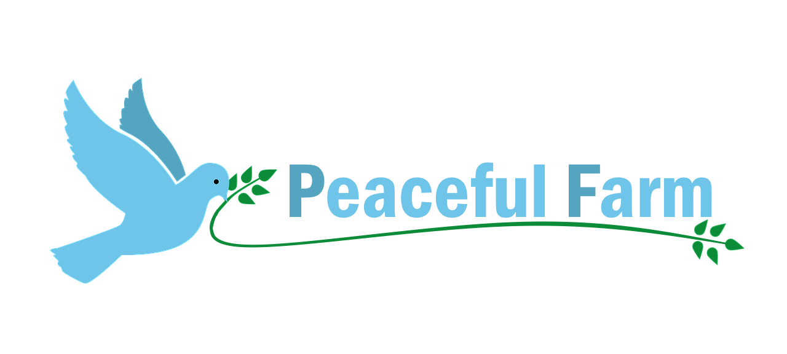
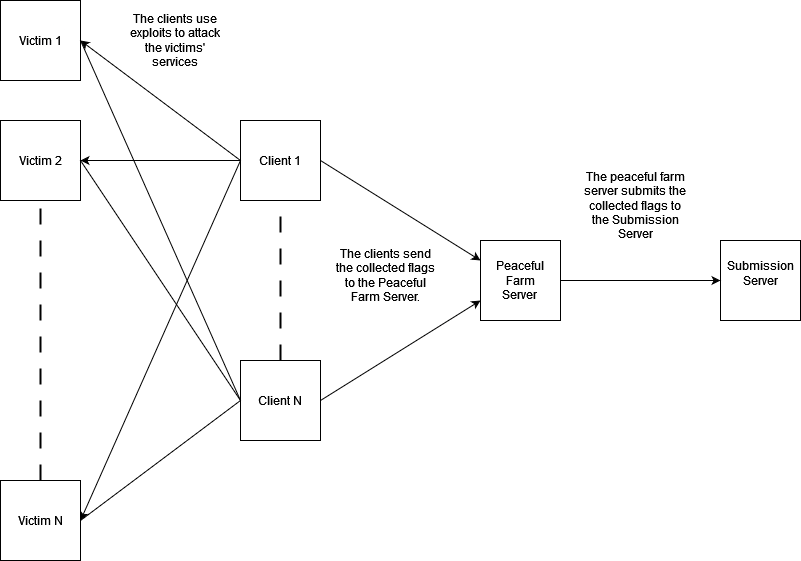

# Peaceful-Farm


## Introduction
**Peaceful Farm** is an Exploit Manager designed for CCIT, its main components are:
- **Peaceful Farm Server**: The Peaceful Farm Server gathers flags from clients and submits them to the game server. It also provides a Web Interface enriched with statistics.
- **Peaceful Farm Client**: The Peaceful Farm Client exploits adversaries' services, gathers flags and sends them to the Peaceful Farm Server.

## Features
- Web interface with statistics and charts on attacks
- Timed flag submission system synchronized with competition rounds
- Automatic generation of multithreaded Python clients
- If the Peaceful Farm server is unreachable the client automatically creates a backup of the stolen flag to send them in the future
- Report in CSV format
- API route protection through authentication
- Web interface protection through authentication
- Management of request concurrency
- Feedback on failed attacks
- Real-time logging in the web interface console
- Emulation of the Submission Server for testing purposes

## Architecture


## Requirements
**Server**:
- Docker
- Docker Compose

**Client**:
- Python3
- Requests library `pip install requests`

## Getting started
### Server
To start using **Peaceful Farm**, you need to launch the server. This can be achieved by running one of the following commands in the `/server` directory:


```bash
docker-compose up -d --build
```

or
```bash
docker compose up -d --build
```

Your server is now ready to use!

You can customize your server by modifing the `/server/.env` file. A more detailed explanation of each option is provided [here](/server/README.md)

### Client
The client can be downloaded either from your **Peaceful Farm Server** by visiting the index page of your server. **However, you'll need to specify in your client the name of the service you're attacking (since Peaceful Farm doesn't have a crystal ball).**

To use the client, you just need to code your exploit in the *exploit* function. The client will automatically launch this function on every opponent team in parallel and send the flags you gather to your **Peaceful Farm Server**.

