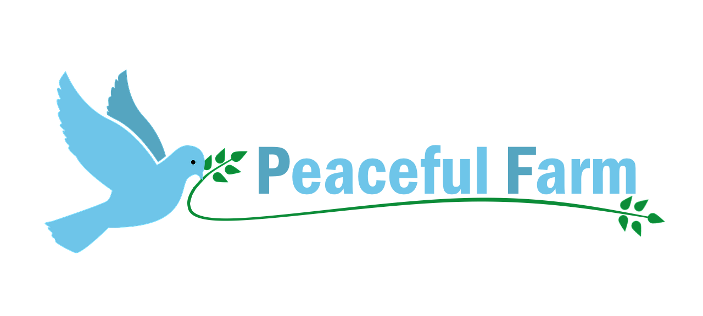
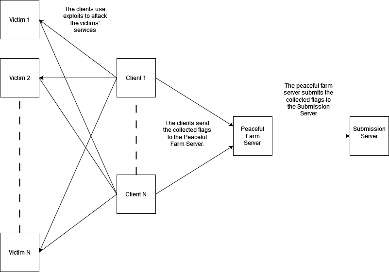
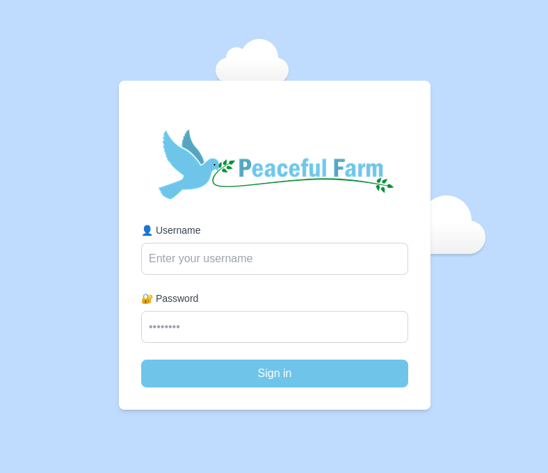
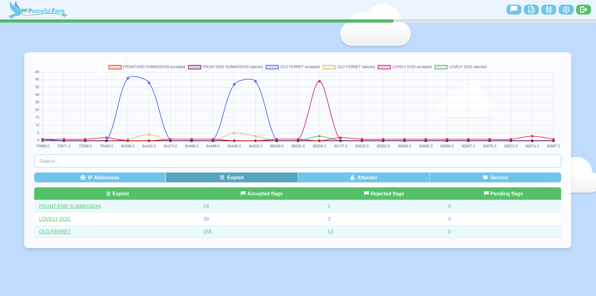
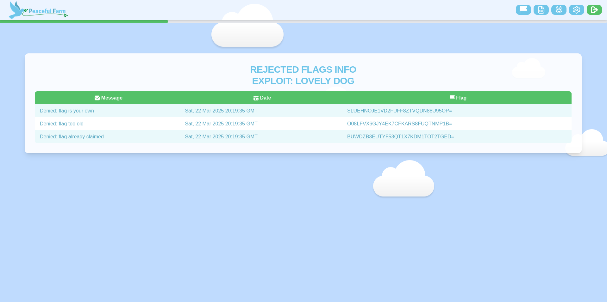
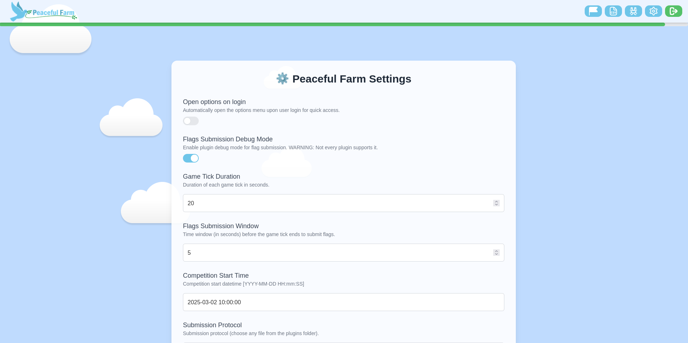

# Peaceful-Farm


## Introduction
**Peaceful Farm** is an Exploit Manager designed for Attack Defence CTFs, its main components are:
- **Peaceful Farm Server**: The Peaceful Farm Server gathers flags from clients and submits them to the game server. It also provides a Web Interface enriched with statistics.
- **Peaceful Farm Client**: The Peaceful Farm Client exploits adversaries' services, gathers flags and sends them to the Peaceful Farm Server.

## Features
- Web interface with statistics and charts on attacks
- Timed flag submission system synchronized with competition rounds
- Automatic generation of multithreaded Python clients
- If the Peaceful Farm server is unreachable the client automatically creates a backup of the stolen flag to send them in the future
- Report in CSV format
- API route protection through authentication
- Web interface protection through authentication
- Management of request concurrency
- Feedback on failed attacks
- Real-time logging in the web interface console
- Emulation of the Submission Server for testing purposes
- A [simple plugin system](web/app/plugins/README.md) to update and adapt the system with ease
- Application setup via GUI

## Architecture


## Requirements
**Server**:
- Docker
- Docker Compose

**Client**:
- Python3

## Getting started
### Server
To start using **Peaceful Farm**, you need to launch the server. This can be achieved by running one of the following commands in the project directory:


```bash
docker-compose up -d --build
```

or
```bash
docker compose up -d --build
```

Your server is now ready to use!

### Client
The client can be downloaded from your **Peaceful Farm Server** by visiting the index page.

To use the client, you just need to code your exploit in the *exploit* function. The client will automatically launch this function on every opponent team in parallel and send the flags you gather to your **Peaceful Farm Server**.

The *exploit* function takes two parameters:  
- **target_ip**: The IP address of the machine being targeted.  
- **exploit_data**: A storage container for any reusable data needed for future exploitations.  

For example, if you're attacking a Flask web app that leaks its secret, you wouldn't want to steal the token every time the exploit runs—doing so could expose your method to others. Instead, storing and reusing the token in *exploit_data* helps maintain stealth and efficiency.  


### Screenshots

#### Login Screen


#### Dashboard Overview


#### Information Page


#### Settings Page

